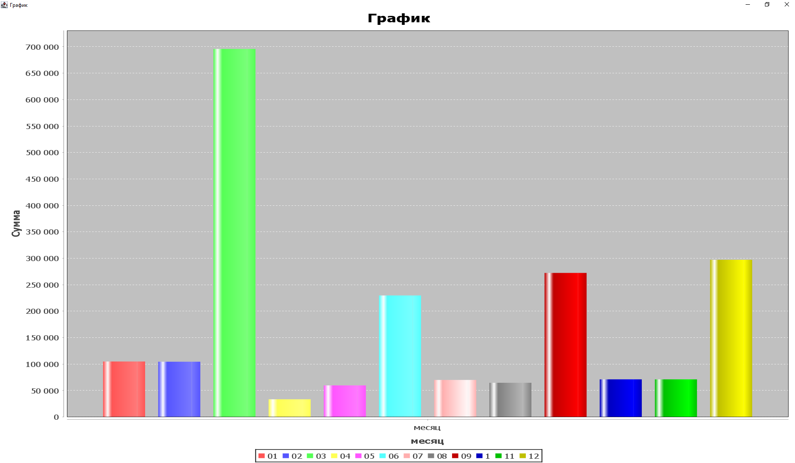

#Java Project


Чтобы сделать задания нужно выполнить следующее:

1) Распарсить данные из csv - файла.
2) Создать таблицы в базе данных sqlite и записать туда распарсенные данные
3) Выполнить задания посредством запросов в созданную базу данных


##1

Создадим класс Transaction , обьект которой будет представлять одну запись таблицы.
Так как для выполнения задания нужны только поля period,data_value и units, возьмем только их

```
public class Transaction {
    private String period;
    private double data_value;
    private String units;

    public String getPeriod() {
        return period;
    }

    public double getData_value(){
        return data_value;
    }

    public String getUnits() {
        return units;
    }

    public Transaction(String period, double data_value, String units){
        this.period = period;
        this.data_value = data_value;
        this.units = units;
    }
}
```
Для выполнения всего остального кода создадим класс Parser с методами Parse(),CreateTable(),FirstTask(),SecondTask() и ThirdTask()

В методе Parse распарсим наши данные, создав при этом для каждой записи обьект класса Transaction и запишем все данные в массив
```
public class Parser {
    public static List<Transaction> transactionList = new ArrayList<>();

    public static void Parse()
    {
        try (BufferedReader br = Files.newBufferedReader(Paths.get("Переводы.csv"))) {
            String line = br.readLine();
            while ((line = br.readLine())!=null){
                String[] lines = line.split(",");
                double data_value;
                if (lines[2].isEmpty())
                {
                    data_value =0;
                }
                else{
                    data_value = Double.parseDouble(lines[2]);
                }
                transactionList.add(new Transaction(lines[1],data_value,lines[5]));

            }
        } catch (Exception e) {
            e.printStackTrace();
        }
    }
}
```
##2
далее в методе CreateTables подключимся к базе данных с помощью драйвера jdbc и запишем все данные в таблицу transactions

```
 public static void CreateTables(){
        try {
            Class.forName("org.sqlite.JDBC");
            Connection connection = DriverManager.getConnection("jdbc:sqlite:transactions.db");
            Statement statement = connection.createStatement();
            statement.execute("CREATE TABLE transactions (id INTEGER PRIMARY KEY AUTOINCREMENT,period TEXT,data_value DOUBLE,units TEXT)");
            for (Transaction transaction : transactionList){
                statement.execute("INSERT INTO transactions (period,data_value,units) " +
                        "VALUES("+transaction.getPeriod()+","+transaction.getData_value()+", '"+transaction.getUnits()+"')");
            }
        }catch (Exception t){
            t.printStackTrace();
        }

    }
```
Теперь всё готово для выполнения заданий

##3

### 1 Задание
С помощью библиотеки JFreechart создадим гистограмму данных
```
 public static void FirstTask(){
        try {
            Class.forName("org.sqlite.JDBC");
            Connection connection = DriverManager.getConnection("jdbc:sqlite:transactions.db");
            Statement statement = connection.createStatement();
            DefaultCategoryDataset dataset = new DefaultCategoryDataset();
            ResultSet resultSet = statement.executeQuery("SELECT substr(period,6,9) as t,sum(data_value) FROM transactions WHERE substr(period,0,5) = '2020' AND units = 'Dollars' GROUP BY t");
            while (resultSet.next())
            {
                dataset.addValue(resultSet.getDouble(2),resultSet.getString(1),"месяц");
            }
            JFreeChart jFreeChart = ChartFactory.createBarChart("График","месяц","Сумма",dataset);
            ChartFrame chartFrame = new ChartFrame("График",jFreeChart);
            chartFrame.setVisible(true);
        }
        catch (Exception t){
            t.printStackTrace();
        }
    }
```
В итоге данный метод выведет следующий график (В данных вместо 10 номера месяца пишется 1)


## 2 Задание

```
 public static void SecondTask(){
        try {
            Class.forName("org.sqlite.JDBC");
            Connection connection = DriverManager.getConnection("jdbc:sqlite:transactions.db");
            Statement statement = connection.createStatement();
            ResultSet resultSet = statement.executeQuery("SELECT period,COUNT(data_value),ROUND(AVG(data_value),2) FROM transactions WHERE units = 'Dollars' GROUP BY period");
            while(resultSet.next()){
                System.out.println(resultSet.getString(1)+", COUNT:"+resultSet.getString(2)+", AVG:"+resultSet.getString(3));

            }
        }
        catch(Exception t){
            t.printStackTrace();
        }

    }
    //В итоге данный метод выведет в консоль сгрупировааные данные из таблицы
    
    ...
    2020.06, COUNT:81, AVG:2835.72
    2020.07, COUNT:40, AVG:1751.77
    2020.08, COUNT:40, AVG:1616.47
    2020.09, COUNT:81, AVG:3362.2
    2020.1, COUNT:40, AVG:1778.07
    2020.11, COUNT:40, AVG:1777.35
    2020.12, COUNT:81, AVG:3668.41
    2021.01, COUNT:40, AVG:1720.67
    2021.02, COUNT:40, AVG:1620.28
    ...
    
   
```

## 3 Задание

```
 public static void ThirdTask(){
        try{
            Class.forName("org.sqlite.JDBC");
            Connection con = DriverManager.getConnection("jdbc:sqlite:transactions.db");
            Statement statement = con.createStatement();
            ResultSet resultSet = statement.executeQuery("SELECT MAX(data_value),MIN(data_value) FROM transactions WHERE substr(period,0,5) IN ('2020','2014','2016') AND units = 'Dollars' AND data_value!=0");
            while(resultSet.next())
            {   
                //Приходится не учитывать переводы с нулем, так как нулем отмечены пустые поля
                System.out.println("MAX: "+resultSet.getString(1)+", MIN: "+resultSet.getString(2));
            }
        }catch(Exception t){
            t.printStackTrace();
        }
    }
    // В итоге данный метод выведет следующее:
    MAX: 93968.7, MIN: 28.7
```
